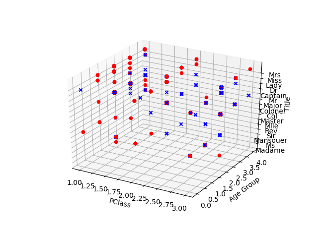

# Task 2 (Titanic)

The given problem is a Boolean classification, supervised learning problem where we need to find a model that approximates a Boolean valued function based on a given training set.

## Preprocessing

### Missing Values

The two columns with missing/ambiguous values are age and PClass(though, only one row contains a missing entry). In both cases, the mean value for the two columns was used to fill in the missing values.

### Adding New Features

Further, passenger title was extracted from each name entry, and a new column called Title was added. The title of Mr and Mrs was assigned to passengers if no title was present in the name based on the Sex column. Having concluded that there was no further benefit from having the Name column present in the dataset, we delete the Name column. Furthermore, given that Sex is a category that can be inferred based on the Title, we can exclude it from the training set.

| PClass | Age | Title |
| :-------------: |:-------------:| :-----:|
| 1  | 29  | 15 |
| 1  |  2  | 15 |
| 1  | 30  | 11 |
||      ...      |
| 3  | 22  | 11 |
| 3  | 24  | 11 |
| 3  | 29  | 11 |

*A sample of the test set after preprocessing; Label column is omitted*

We then proceed to plot the dataset:

## Learning Algorithms Summary and Analysis

The following algorithms are considered based on the fact that we are dealing with a supervised learning, classification problem:

* Logistic Regression
* SVM
* Naive Bayes
* Decision Trees

### Decision Trees

* Instances are represented by attribute-value pairs. Instances are described by a fixed set of attributes (e.g., PClass and their values (e.g., 1st Class). The easiest situation for decision tree learning is when each attribute takes on a small number of disjoint possible values (e.g., 1st, 2nd, 3rd)
* The target function has discrete output values(e.g. dead/alive)
* Disjunctive descriptions may be required. As noted above, decision trees
naturally represent disjunctive expressions.
* The training data may contain errors. Decision tree learning methods are
robust to errors, both errors in classifications of the training examples and
errors in the attribute values that describe these examples.
* The training data may contain missing attribute values. Decision tree methods can be used even when some training examples have unknown values (e.g., if the Age of a passenger is unknown). Unfortunately, scikit does not implement this feature of CART or C4.5 algorithms.

In an attempt to get a better accuracy with Decision Trees, Age was grouped into 4 categories. The following results were achieved:

| Truth | Decision tree prediction | Probabilities |
| :---:   | :------------------: | :----: |
| 0 | 0 | 1.         |
| 0 | 0 | 1.         |
| 1 | 1 | 0.11111111 |
| 0 | 0 | 0.95652174 |
| 0 | 0 | 0.88221154 |
| 0 | 0 | 0.88221154 |
| 1 | 0 | 0.73076923 |
| 1 | 1 | 0.33333333 |
| 1 | 1 | 0.04545455 |
| 1 | 0 | 0.65686275 |

which amounts to 80% test set accuracy.

### SVM With Gaussian Kernel
* An SVM model is a representation of the examples as points in space, mapped so that the examples of the separate categories are divided by a clear gap that is as wide as possible. New examples are then mapped into that same space and predicted to belong to a category based on which side of the gap they fall.
* Parameters used for cross-validation: C and delta.

| Truth | SVM prediction | SVM probabilities |
| :---:   | :------------------: | :-----: |
| 0 | 0 | 0.70368733 |
| 0 | 0 | 0.70368733 |
| 1 | 1 | 0.09037744 |
| 0 | 0 | 0.77882460 |
| 0 | 0 | 0.82853169 |
| 0 | 0 | 0.82853169 |
| 1 | 0 | 0.82852585 |
| 1 | 1 | 0.10368514 |
| 1 | 1 | 0.09035237 |
| 1 | 0 | 0.82828384 |

80% accuracy.

### Logistic Regression
* Parameters for cross-validation: C.

| Truth | Decision Tree Prediction | Decision Tree Probabilities |
| :---:   | :------------------: | :-------: |
| 0 | 0 | 0.8060508  |
| 0 | 0 | 0.8060508  |
| 1 | 1 | 0.49865333 |
| 0 | 0 | 0.97701487 |
| 0 | 0 | 0.86647601 |
| 0 | 0 | 0.86647601 |
| 1 | 0 | 0.57652009 |
| 1 | 1 | 0.46577892 |
| 1 | 1 | 0.39466692 |
| 1 | 1 | 0.39928502 |

90% accuracy.

### Naive Bayes

* The naive Bayes classifier is a Bayesian learning method that has been found to be useful in many practical applications. It is called "naive" because it incorporates the simplifying assumption that attribute values are conditionally independent, given the classification of the instance. It is for this reason that Sex column was deleted during data preprocessing.
* On the flip side, although naive Bayes is known as a decent classifier, it is known to be a bad estimator, so the probability outputs from predict_proba are not to be taken too seriously. Nonetheless, the probabilities for Naive Bayes are provided.

| Truth | Naive Bayes Prediction | Naive Bayes Probabilites |
| :---:   | :------------------: | :----: |
| 0 | 0 | 0.63150232 |
| 0 | 0 | 0.63150232 |
| 1 | 1 | 0.25807405 |
| 0 | 0 | 0.77943506 |
| 0 | 0 | 0.92219075 |
| 0 | 0 | 0.92219075 |
| 1 | 1 | 0.46352329 |
| 1 | 1 | 0.02728194 |
| 1 | 1 | 0.01342862 |
| 1 | 0 | 0.57476835 |

90% test set accuracy.

# Conclusion

Because the initial task was to predict the probability of survival, we eliminate Naive Bayes and Decision Trees as viable candidates for this task as their probabilistic results don't accurately reflect the actual probability of survival. Therefore, it all comes down to SVM vs Logistic Regression. Given the size of the training set (approx. 1300 entries with 3 features), we conclude that the best algorithm for this problem is SVM with Gaussian Kernel, despite the fact that it produced a model with lower test set accuracy. However, we can easily attribute this to statistical noise because of the test size.
