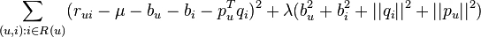
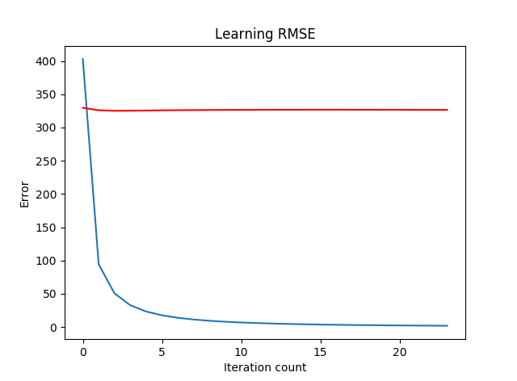

# Task 2 (Titanic)

The given problem is a Boolean classification, supervised learning problem where we need to find a model that approximates a Boolean valued function based on a given training set.

## Preprocessing

### Missing Values

The two columns with missing/ambiguous values are age and PClass(though, only one row contains a missing entry). In both cases, the mean value for the two columns was used to fill in the missing values.

### Adding New Features

Further, passenger title was extracted from each name entry, and a new column called Title was added. The title of Mr and Mrs was assigned to passengers if no title was present in the name based on the Sex column. Having concluded that there was no further benefit from having the Name column present in the dataset, we delete the Name column. Furthermore, given that Sex is a category that can be inferred based on the Title, we can exclude it from the training set.

| PClass | Age | Title |
| :-------------: |:-------------:| :-----:|
| 1  | 29  | 15 |
| 1  |  2  | 15 |
| 1  | 30  | 11 |
||      ...      |
| 3  | 22  | 11 |
| 3  | 24  | 11 |
| 3  | 29  | 11 |

*A sample of the test set after preprocessing; Label column is omitted*

We then proceed to plot the dataset:

## Learning Algorithms Summary and Analysis

The following algorithms are considered based on the fact that we are dealing with a supervised learning, classification problem:

* Logistic Regression
* SVM
* Naive Bayes
* Decision Trees

### Decision Trees

* Instances are represented by attribute-value pairs. Instances are described by a fixed set of attributes (e.g., PClass and their values (e.g., 1st Class). The easiest situation for decision tree learning is when each attribute takes on a small number of disjoint possible values (e.g., 1st, 2nd, 3rd)
* The target function has discrete output values(e.g. dead/alive)
* Disjunctive descriptions may be required. As noted above, decision trees
naturally represent disjunctive expressions.
* The training data may contain errors. Decision tree learning methods are
robust to errors, both errors in classifications of the training examples and
errors in the attribute values that describe these examples.
* The training data may contain missing attribute values. Decision tree methods can be used even when some training examples have unknown values (e.g., if the Age of a passenger is unknown). Unfortunately, scikit does not implement this feature of CART or C4.5 algorithms.

In an attempt to get a better accuracy with Decision Trees, Age was grouped into 4 categories. The following results were achieved:

| Truth | Decision tree prediction | Probabilities |
| :---:   | :------------------: | :----: |
| 0 | 0 | 1.         |
| 0 | 0 | 1.         |
| 1 | 1 | 0.11111111 |
| 0 | 0 | 0.95652174 |
| 0 | 0 | 0.88221154 |
| 0 | 0 | 0.88221154 |
| 1 | 0 | 0.73076923 |
| 1 | 1 | 0.33333333 |
| 1 | 1 | 0.04545455 |
| 1 | 0 | 0.65686275 |

which amounts to 80% test set accuracy.

### SVM With Gaussian Kernel
* An SVM model is a representation of the examples as points in space, mapped so that the examples of the separate categories are divided by a clear gap that is as wide as possible. New examples are then mapped into that same space and predicted to belong to a category based on which side of the gap they fall.
* Parameters used for cross-validation: C and delta.

| Truth | SVM prediction | SVM probabilities |
| :---:   | :------------------: | :-----: |
| 0 | 0 | 0.70368733 |
| 0 | 0 | 0.70368733 |
| 1 | 1 | 0.09037744 |
| 0 | 0 | 0.77882460 |
| 0 | 0 | 0.82853169 |
| 0 | 0 | 0.82853169 |
| 1 | 0 | 0.82852585 |
| 1 | 1 | 0.10368514 |
| 1 | 1 | 0.09035237 |
| 1 | 0 | 0.82828384 |

80% accuracy.

### Logistic Regression
* Parameters for cross-validation: C.

| Truth | Decision Tree Prediction | Decision Tree Probabilities |
| :---:   | :------------------: | :-------: |
| 0 | 0 | 0.8060508  |
| 0 | 0 | 0.8060508  |
| 1 | 1 | 0.49865333 |
| 0 | 0 | 0.97701487 |
| 0 | 0 | 0.86647601 |
| 0 | 0 | 0.86647601 |
| 1 | 0 | 0.57652009 |
| 1 | 1 | 0.46577892 |
| 1 | 1 | 0.39466692 |
| 1 | 1 | 0.39928502 |

90% accuracy.

### Naive Bayes

* The naive Bayes classifier is a Bayesian learning method that has been found to be useful in many practical applications. It is called "naive" because it incorporates the simplifying assumption that attribute values are conditionally independent, given the classification of the instance. It is for this reason that Sex column was deleted during data preprocessing.
* On the flip side, although naive Bayes is known as a decent classifier, it is known to be a bad estimator, so the probability outputs from predict_proba are not to be taken too seriously. Nonetheless, the probabilities for Naive Bayes are provided.

| Truth | Naive Bayes Prediction | Naive Bayes Probabilites |
| :---:   | :------------------: | :----: |
| 0 | 0 | 0.63150232 |
| 0 | 0 | 0.63150232 |
| 1 | 1 | 0.25807405 |
| 0 | 0 | 0.77943506 |
| 0 | 0 | 0.92219075 |
| 0 | 0 | 0.92219075 |
| 1 | 1 | 0.46352329 |
| 1 | 1 | 0.02728194 |
| 1 | 1 | 0.01342862 |
| 1 | 0 | 0.57476835 |

90% test set accuracy.

# Conclusion

Because the initial task was to predict the probability of survival, we eliminate Naive Bayes and Decision Trees as viable candidates for this task as their probabilistic results don't accurately reflect the actual probability of survival. Therefore, it all comes down to SVM vs Logistic Regression. Given the size of the training set (approx. 1300 entries with 3 features), we conclude that the best algorithm for this problem is SVM with Gaussian Kernel, despite the fact that it produced a model with lower test set accuracy. However, we can easily attribute this to statistical noise because of the test size.

# Task 3 (Movie Recommendation system)

To increase revenue, companies such as Amazon, Netflix, Google need ways to offer personalized product suggestions to their customer base.
In 2009, Netflix offered 1 million dollars to the first team that managed to improve their movie recommendation algorithm by 10%.

Given data about each user’s movie preference and given each movie’s metadata(plot keywords, budget, director name, etc.), create a machine learning model that predicts each user’s movie preference.

## Useful Links

[Model-based CF](http://www.cs.carleton.edu/cs_comps/0607/recommend/recommender/modelbased.html)

[One-Hot vs integer](https://machinelearningmastery.com/why-one-hot-encode-data-in-machine-learning/)

[Matrix Factorization](http://www.quuxlabs.com/blog/2010/09/matrix-factorization-a-simple-tutorial-and-implementation-in-python/)

[Wikia](http://stat.wikia.com/wiki/Matrix_factorization)

[C++ SVD RS](https://github.com/timnugent/svd-recommend)

[Another C++ RS](https://github.com/yixuan/recosystem)

[SVD++](http://www.recsyswiki.com/wiki/SVD%2B%2B)

[Basic Clustering Model](http://cs229.stanford.edu/proj2013/Bystrom-MovieRecommendationsFromUserRatings.pdf)

[Blog](http://sifter.org/~simon/journal/20061211.html)

[SVD & PMF Ppt](http://dparra.sitios.ing.uc.cl/classes/recsys-2015-2/student_ppts/CRojas_SVDpp-PMF.pdf)

[SVD vs SVD++](https://www.quora.com/Whats-the-difference-between-SVD-and-SVD++)

[Netflix clustering](https://rpubs.com/nishantsbi/93582)

[ALS](https://bugra.github.io/work/notes/2014-04-19/alternating-least-squares-method-for-collaborative-filtering/)

## The Algorithm

### Matrix factorization
After spending some time on researching on algorithms, I came to the conclusion that most state-of-the-art recommendation systems use matrix factorization techniques at some point in their pipeline. 

The idea is to give each user and movie a feature and then obtain the predicted rating after multiplying the two vectors. The way we obtain the two vectors is by minimizing the following error function:

where \mu is the user-item bias, the purpose of which is explained in the following section.

### The Role of User-Item Bias
If a user is cynical, and gives low movie ratings(1 - 2) to most movies that he watches, then that must mean that he really really likes the few movies that he gives a high rating(4-5).

Furthermore, the algorithm should also be weary of users that give low ratings to movies that do well in terms of ratings(such as The Dark Knight).

## Notes Made During Preprocessing

# Dataset Preprocessing and Analysis 

Max movie id: 176279
Max user id: 270896

normalize:
movieId
gtags
director name

## Steps:

### movie meta
1. fillna
2. map str to ind
3. normalize
4. movie str preprocess
5. binary encode genres
6. map plot keywords
7. delete useless

## movies.csv
movieId

title

genres

## genome-tags.csv
tagId

tag

## ratings.csv
userId

movieId

rating
timestamp

## tags.csv
userId

movieId

tag

timestamp

## genome-scores.csv
movieId

tagId

relevance

## links.csv
movieId

imdbId

tmdbId

## Movie Metadata

### movie\ metadata.csv
color
map to index
nan -> 0

### director name
map to index
na -> 0

### num critic for reviews
na -> 0

### duration
given in minutes
na -> avg

### director facebook likes
na -> 0

### actor 3 facebook likes
na -> 0

### actor 2 name
na -> 0

### actor 1 facebook likes
na -> 0

### gross
na -> 0

### genres
binary encode

### actor 1 name
map to index

### movie title
map to index
delete?

### num voted users
nan -> 0

### cast total facebook likes
nan -> 0

### actor 3 name
map to index
na -> 0

### facenumber in poster
facenumber??
nan -> 0

### plot keywords
8087 plot keywords in dataset.
Max 5 keywords per movie.
fillna to 'none'
astype(str)

### movie imdb link
Extract id.

### num user for reviews
nan -> 0

### language
map str to ind

### country
map str to ind

### content rating
map str to ind

### budget
nan -> 0
normalize:
    * number of digits(log10)

### title year
Min: 1916
year - 1915
nan -> 0

### actor 2 facebook likes
nan -> 0

### imdb score
Normalize to [0.0, 1.0]

### aspect ratio
delete

### movie facebook likes
na -> 0

## The Results

Although I am sure that the choice of algorithm was the right one, the grim-looking flat red line indicates the presence of overfitting, that was most probably caused by the relatively small size of the dataset.

# Conclusion

The problem defnitely turned out to be more difficult than I initialy expected it to be. To get rid of overfitting, one probably has to put more work into parameter tuning and dataset selection and training.

